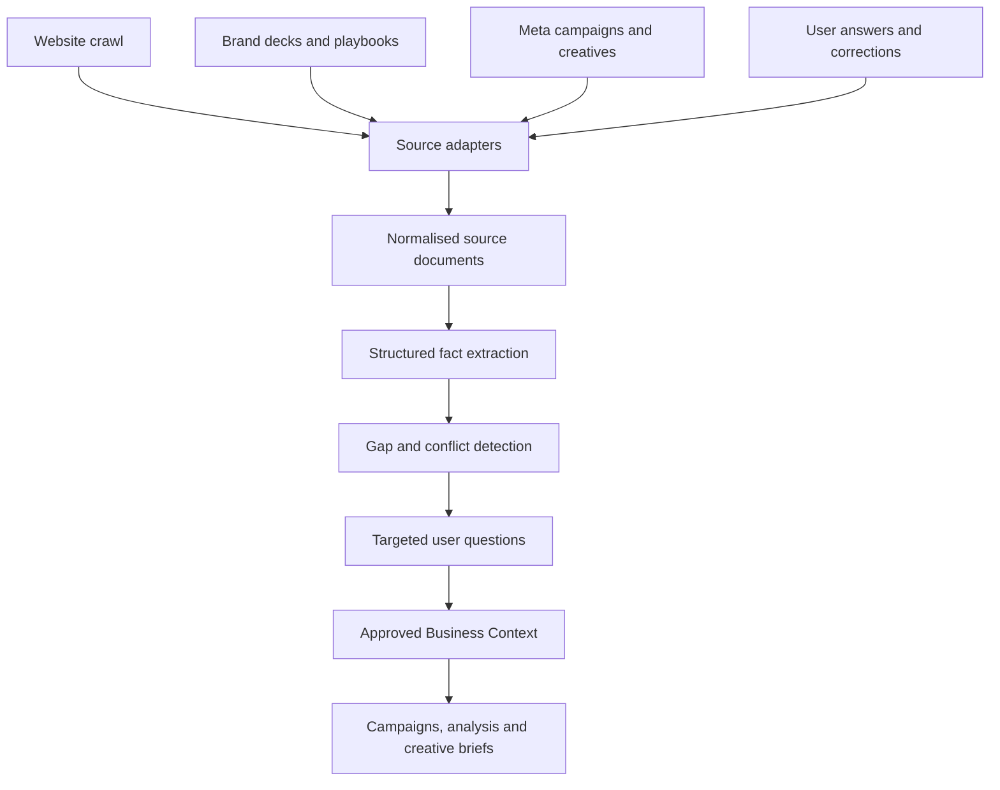
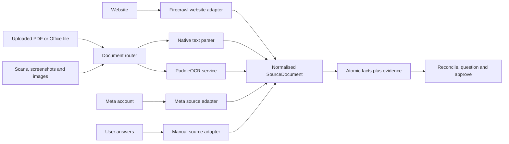

# PRD 006: Business Context Onboarding and Management

> **Supersession note (July 2026):** The original PaddleOCR and native-parser (mammoth/pdf-parse/xlsx/jszip/html-to-text) document parsers have been replaced by a single Docling-based Python converter running as a subprocess of the main TS worker. Schema now stores processed Markdown artifacts in Supabase Storage plus chunks + embeddings in `document_chunks` (pgvector). See `docs/superpowers/plans/2026-07-19-docling-hybrid-retrieval.md` for current architecture.

## 1. Objective

Build the backend system that creates, stores, verifies, versions and serves a business-specific context for NOVA.

Business Context is created during onboarding and remains editable from a permanent Business Context section. It gives NOVA the information required to interpret Meta results against the client's actual business goals, generate relevant recommendations and produce evidence-backed creative briefs.

## 2. Core Outcome

NOVA must be able to answer:

- What does this business sell?
- Who makes the buying decision?
- What business outcome matters beyond the Meta conversion?
- What are the target economics and budget constraints?
- What claims, proof and brand rules apply?
- What can the creative team realistically produce?
- Which facts are verified, uncertain or contradictory?
- Which Business Context version was used for a recommendation?

## 3. Product Flow



Business Context has two entry points:

1. **Onboarding flow:** creates Business Context v1 before NOVA produces recommendations or launches campaigns.
2. **Business Context tab:** lets authorised users inspect sources, edit facts, resolve conflicts and approve later versions.

Frontend implementation is deferred. This PRD defines backend behaviour, persistence, APIs and future screen requirements.

## 4. Storage Decision

Supabase is the V1 system of record.

### Supabase Postgres

Stores:

- Users, workspaces and memberships
- Businesses
- Business Context sources, facts, conflicts and versions
- Onboarding state and questions
- Meta object metadata and daily ad-level performance
- Hypotheses, briefs, recommendations, approvals and audit records added later

### Supabase Storage

Stores:

- Raw website snapshots when retention is required
- Uploaded brand documents
- Large CSV imports
- Creative images and videos
- Archived raw API payloads

Postgres stores the file reference, checksum, metadata and ownership.

### DuckDB

DuckDB is not required for this PRD. It may later be introduced as a temporary analytical engine for large historical queries, feature engineering or ML datasets. Analytical outputs must be written back to Supabase; DuckDB must never become a second source of truth.

## 5. Scope

### Included

- Business creation
- Onboarding session lifecycle
- Multi-source ingestion through a shared adapter contract
- Public website discovery and bounded crawling through Firecrawl
- Upload and parsing of PDF, DOC, DOCX, PPT and PPTX brand documents, playbooks and campaign briefs
- Optional ingestion of connected Meta campaigns, ads, ad sets and creative metadata
- Raw source and evidence storage
- LLM-based structured extraction
- Fact normalisation and deduplication
- Conflict detection
- Targeted follow-up questions
- Manual answers and corrections
- User verification and approval
- Business Context profile versioning
- Updates after onboarding
- Task-specific context compilation
- Supabase Row Level Security
- Audit history
- Retryable background jobs

### Deferred

- Final onboarding UI
- Final Business Context tab UI
- Shopify integration
- CRM and revenue integrations
- Competitor discovery
- Creative generation
- Hypothesis and experiment management
- Automatic Meta mutations
- DuckDB analytical jobs

The source adapter contract must support future integrations without changing the context domain model. Website, uploaded document, Meta and manual-input adapters all produce the same normalised `SourceDocument` contract before extraction.

## 6. Business Context Schema

Business Context contains eight sections.

| Section | Required information |
|---|---|
| Business | Name, industry, business model, markets, locations, seasonality |
| Offers | Products/services, price, promotion, differentiators, primary advertised offer |
| Customers | Decision maker, end user, personas, problems, desired outcomes, objections |
| Conversion Journey | Meta conversion, downstream outcome, funnel steps, typical conversion lag |
| Economics | Monthly budget, target CPL/CPA/ROAS, average value, lead-to-customer rate, limits |
| Brand | Positioning, tone, proof, approved claims, prohibited claims, disclaimers |
| Creative Capacity | Producer, supported formats, weekly capacity, turnaround time, available assets |
| Measurement | Meta account, pixel/dataset, conversion event, outcome source, attribution constraints |

Each material fact must preserve:

- Value
- Source
- Source excerpt
- Confidence
- Verification status
- Validity period
- Creation and update timestamps

## 7. Onboarding Lifecycle

Statuses:

```text
created
scanning
extracting
awaiting_review
awaiting_answers
ready_for_approval
approved
failed
```

An onboarding session cannot become `approved` until required fields are user-verified or explicitly marked unknown.

### Required initial inputs

- Business name
- At least one evidence source: website URL, uploaded business document or connected Meta account
- Primary country or market
- Primary advertising objective
- Primary business outcome
- Approximate monthly Meta budget

### Optional inputs

- Additional website URLs
- Brand decks, brand playbooks, product sheets, campaign briefs and research documents
- Meta ad account connection
- Target CPA, CPL or ROAS
- Brand guidelines
- Known personas
- Current outcome source
- Creative production capacity

## 8. Multi-source Ingestion

Business Context must not depend on a website alone. A website represents public positioning, while internal decks and playbooks often contain the actual strategy, constraints and approved language. Connected Meta data adds operational evidence about what the business has run. No source writes directly to an approved profile.



### Source classes

V1 supports:

- `website`: public business pages.
- `brand_deck`: brand strategy or positioning decks.
- `brand_playbook`: tone, visual, claim and compliance rules.
- `product_document`: offer, pricing and product details.
- `campaign_brief`: campaign goals, audiences, hypotheses and approved messaging.
- `research_document`: customer, market or qualitative research.
- `meta`: campaigns, ad sets, ads and creative metadata from the connected account.
- `user_answer`: answers and manual corrections supplied by an authorised user.

The user must label an uploaded document, or accept a system-proposed label, because authority and intended scope cannot be inferred safely from file contents alone.

### Firecrawl integration

Use Firecrawl as the V1 acquisition and cleaning service for websites and public document URLs.

- Use `/crawl` for a bounded website crawl and `/scrape` for a specific public page or public document URL.
- Request clean Markdown from Firecrawl. NOVA performs canonical fact extraction through its own extraction port so every source uses one schema and one resolution process.
- Keep the Firecrawl API key server-side and store no key in browser code or Business Context.
- Track pages parsed, credits consumed, parser mode, truncation and provider request ID on every job.
- Enforce configurable page, file-size and credit budgets before dispatch. V1 defaults are 30 website pages, 50 MB per uploaded file and an administrator-configured per-business credit ceiling.
- Cache by content hash and do not reprocess unchanged content.
- Firecrawl pricing is external and may change. Cost controls must use metered credits rather than hard-coded plan prices.

### PaddleOCR integration

Use PaddleOCR as NOVA's self-hosted document-intelligence service for uploaded documents, scanned pages, images, screenshots and image-heavy presentations. PaddleOCR complements Firecrawl; it does not crawl websites and it does not replace NOVA's fact-extraction or reasoning layer.

#### Routing strategy

1. Inspect extension, MIME type and document structure.
2. Attempt native extraction for text-based PDF, DOCX, XLSX, PPTX and HTML because native parsing is faster and preserves exact text, links, speaker notes and document structure.
3. Route scanned, image-only, malformed or layout-heavy pages through PaddleOCR.
4. Use PaddleOCR for uploaded images and screenshots by default.
5. Merge native and OCR results without duplicating text, preserving the best evidence locator for every element.
6. Emit one normalised `SourceDocument` regardless of parser path.

#### Initial PaddleOCR capabilities

- Use PP-StructureV3 as the default V1 document pipeline for layout-aware parsing, tables, headings and coordinate-level evidence.
- Evaluate PaddleOCR-VL behind a feature flag for unusually complex pages, charts, formulas and difficult layouts; do not make it the default until benchmarked on representative NOVA documents.
- Use the standard OCR pipeline for isolated images, screenshots and visible text inside Meta creative assets.
- Produce Markdown for downstream LLM extraction and structured JSON for layout elements, bounding boxes, tables and evidence locations.
- Preserve document page, PowerPoint slide, element type and bounding box where available.
- Store model family, model version, runtime, hardware class, processing duration and OCR confidence with each processing result.

#### Deployment boundary

PaddleOCR runs as a separate Python worker or internal service, not inside the Next.js request process. The worker consumes asynchronous processing jobs, reads originals from the private Supabase Storage bucket, writes normalised results back to Supabase and then deletes temporary local files. CPU deployment must be supported for development and low volume; production may use GPU-backed workers when measured throughput justifies it.

The integration may use PaddleOCR under its Apache 2.0 licence, subject to retaining required licence and attribution notices in NOVA's third-party notices. Pin all package and model versions; model upgrades require a replayable benchmark and parser-version change.

### Unified document parser contract

```ts
interface DocumentParserPort {
  supports(input: DocumentDescriptor): Promise<SupportDecision>;
  parse(input: ParseDocumentInput): Promise<ParsedDocument>;
}

interface ParsedDocument {
  markdown: string;
  elements: Array<{
    type: string;
    text?: string;
    page?: number;
    slide?: number;
    boundingBox?: number[];
    confidence?: number;
  }>;
  parser: { name: string; version: string; model?: string };
  warnings: string[];
}
```

Parser output is evidence, not Business Context truth. NOVA's schema-constrained extraction layer converts parsed elements into atomic facts, and the existing reconciliation process determines which facts can be proposed to the user.

Original uploads live in a private Supabase Storage bucket. Postgres stores their metadata and storage reference; extracted text and atomic facts are stored separately so a source can be re-parsed without losing history.

### Crawl rules

The website adapter must:

- Start from the supplied canonical URL.
- Respect robots directives and timeouts.
- Prefer sitemap URLs when available.
- Remain on the approved domain.
- Reject localhost, private-network and non-HTTP(S) targets.
- Limit V1 scans to 30 pages and 5 MB of normalised text per business.
- Prioritise homepage, about, offer, pricing, FAQ, testimonial and conversion pages.
- Store URL, title, normalised text or storage reference, content hash, status and retrieval time.
- Deduplicate by canonical URL and content hash.
- Treat crawled content as untrusted data, never as system instructions.

### Uploaded document rules

- Accept only an explicit extension and detected MIME-type allowlist.
- Reject encrypted, password-protected, executable or malformed files with a clear error.
- Calculate a checksum before parsing and deduplicate identical uploads within a business.
- Record filename, MIME type, bytes, checksum, storage path, document class, effective date, uploaded-by user, parser, parser version and page or slide count.
- Preserve page or slide numbers in evidence locators.
- Preserve bounding boxes for OCR-derived evidence so the future UI can highlight the exact source region.
- Allow a document to supersede an older source without deleting the older source or its facts.
- Archive sources rather than hard-delete them from evidence history; separately support privacy-driven deletion under the retention policy.

### Meta source boundaries

Meta is evidence of what was configured and run, not automatically the official brand truth. It may propose active offers, messages, audiences, markets, objectives and measurement configuration. PaddleOCR may extract visible headlines, offers, calls to action, disclaimers and proof from connected image creatives. Campaign results belong to NOVA's learning memory and can support hypotheses, but performance alone must not rewrite approved positioning, claims, economics or brand policy.

### Extraction jobs

Run separate schema-constrained tasks for:

1. Business and offers
2. Customers and decision makers
3. Conversion journey
4. Brand, proof and claims
5. Gaps and contradictions
6. Profile synthesis

These tasks may run concurrently but cannot write directly to an approved profile.

### Extraction output

```json
{
  "facts": [
    {
      "key": "customers.decision_maker",
      "value": "Parents of primary-school students",
      "source_document_id": "uuid",
      "source_excerpt": "Our programmes help parents...",
      "confidence": 0.82
    }
  ],
  "missing_fields": [],
  "warnings": []
}
```

Validate all LLM output with Zod before persistence. Invalid output receives one schema-repair attempt and then fails the job without publishing partial profile state.

## 9. Fact Resolution

### Proposed-value precedence

1. User-verified answer
2. Authoritative business-owned source with explicit scope and effective date
3. Connected first-party operational system
4. Current official website
5. Meta account evidence
6. LLM inference

Precedence selects a proposed current value. It does not delete lower-priority evidence. Recency, document scope and fact type also matter: a current brand playbook may govern tone while a campaign brief governs one campaign only. Material conflicts are always surfaced even when precedence can propose a winner.

### Conflicts

A conflict exists when materially different active values exist for the same fact key.

Example:

```text
Website: Free assessment
Meta ads: Free trial class
```

The system must:

- Preserve both facts.
- Mark the field unresolved.
- Generate one targeted question.
- Record the selected value and resolution note.
- Preserve the resolved conflict in history.

### Missing information

Questions must be generated only for required gaps, material uncertainty or conflicts. Do not ask the user to reconfirm high-confidence, non-critical facts.

Supported question types:

- Single choice
- Multiple choice
- Number or currency
- Short text
- Long text
- Confirmation

## 10. Supabase Data Model

All tenant-owned tables include `workspace_id` and use RLS.

### `workspaces`

```text
id uuid primary key
name text not null
created_at timestamptz not null
```

### `workspace_members`

```text
workspace_id uuid not null
user_id uuid not null
role text not null
created_at timestamptz not null
primary key (workspace_id, user_id)
```

Roles:

```text
owner
admin
editor
viewer
```

### `businesses`

```text
id uuid primary key
workspace_id uuid not null
name text not null
website_url text
status text not null
created_at timestamptz not null
updated_at timestamptz not null
```

### `onboarding_sessions`

```text
id uuid primary key
workspace_id uuid not null
business_id uuid not null
status text not null
current_step text
started_by uuid not null
started_at timestamptz not null
completed_at timestamptz
error jsonb
```

### `context_sources`

```text
id uuid primary key
workspace_id uuid not null
business_id uuid not null
source_type text not null
source_name text not null
external_reference text
status text not null
metadata jsonb not null default '{}'
collected_at timestamptz not null
```

V1 `source_type`:

```text
website
brand_deck
brand_playbook
product_document
campaign_brief
research_document
user_answer
meta
system_inference
```

Reserved future values:

```text
shopify
crm
payments
csv
webhook
```

### `source_documents`

```text
id uuid primary key
workspace_id uuid not null
business_id uuid not null
source_id uuid not null
url text
title text
document_type text
mime_type text
file_name text
file_size_bytes bigint
content_text text
storage_path text
content_hash text not null
http_status integer
page_or_slide_count integer
parser_name text
parser_version text
effective_at timestamptz
supersedes_document_id uuid
metadata jsonb not null default '{}'
retrieved_at timestamptz not null
```

### `context_facts`

```text
id uuid primary key
workspace_id uuid not null
business_id uuid not null
fact_key text not null
value jsonb not null
source_id uuid not null
source_document_id uuid
source_excerpt text
evidence_locator jsonb
confidence numeric not null check (confidence >= 0 and confidence <= 1)
verification_status text not null
supersedes_fact_id uuid
valid_from timestamptz not null
valid_to timestamptz
created_at timestamptz not null
created_by text not null
```

`verification_status`:

```text
extracted
inferred
user_verified
rejected
superseded
```

### `context_conflicts`

```text
id uuid primary key
workspace_id uuid not null
business_id uuid not null
fact_key text not null
fact_ids uuid[] not null
status text not null
resolution_fact_id uuid
resolution_note text
resolved_by uuid
created_at timestamptz not null
resolved_at timestamptz
```

### `onboarding_questions`

```text
id uuid primary key
workspace_id uuid not null
session_id uuid not null
business_id uuid not null
fact_key text not null
question_type text not null
question text not null
options jsonb
reason text not null
priority integer not null
status text not null
answer jsonb
answered_by uuid
answered_at timestamptz
```

### `business_profile_versions`

```text
id uuid primary key
workspace_id uuid not null
business_id uuid not null
version integer not null
profile jsonb not null
profile_markdown text
status text not null
change_summary text
created_by uuid not null
created_at timestamptz not null
approved_by uuid
approved_at timestamptz
unique (business_id, version)
```

Only one version per business may be current. Enforce using a partial unique index:

```sql
create unique index one_current_business_profile
on business_profile_versions (business_id)
where status = 'current';
```

### `context_jobs`

```text
id uuid primary key
workspace_id uuid not null
business_id uuid not null
session_id uuid
job_type text not null
status text not null
attempt_count integer not null default 0
idempotency_key text not null unique
input jsonb not null
output jsonb
error jsonb
created_at timestamptz not null
started_at timestamptz
completed_at timestamptz
```

### `context_audit_log`

```text
id uuid primary key
workspace_id uuid not null
business_id uuid not null
actor_id uuid
actor_type text not null
event_type text not null
entity_type text not null
entity_id uuid not null
before jsonb
after jsonb
created_at timestamptz not null
```

## 11. Row Level Security

Enable RLS on every tenant-owned table.

Policies must ensure:

- Users can read only rows whose `workspace_id` exists in their `workspace_members` rows.
- Owners and admins can approve and restore Business Context versions.
- Editors can create facts, answer questions and create drafts.
- Viewers are read-only.
- Service-role operations are limited to server-side ingestion and extraction jobs.
- No browser bundle contains the Supabase service-role key.

Storage buckets must apply the same workspace ownership boundary through path conventions and storage policies.

## 12. Profile Versioning

### Draft compilation

Compile the draft from active facts using:

- Source precedence
- Verification status
- Required-field validation
- Conflict state
- Confidence thresholds

### Approval transaction

Approval must run in one Postgres transaction or database function:

1. Validate required sections.
2. Reject unresolved critical conflicts.
3. Insert an immutable profile version.
4. Mark the previous current version `superseded`.
5. Mark the approved version `current`.
6. Write an audit event.

### Later updates

Edits from the Business Context tab never mutate the current approved profile directly.

They must:

1. Create new user-verified facts.
2. Compile a draft next version.
3. Produce a field-level diff.
4. Require approval.
5. Publish the next current version.

Restoring an earlier profile creates a new version from the previous snapshot. It does not delete intervening versions.

## 13. Context Compiler

NOVA must not send the complete profile into every LLM request.

Supported purposes:

```text
campaign_setup
performance_analysis
optimization
hypothesis_generation
creative_brief
tracking_audit
```

The compiler returns only the required sections and records the exact profile version.

```json
{
  "purpose": "creative_brief",
  "business_context_version": 3,
  "context": {
    "offers": {},
    "customers": {},
    "brand": {},
    "creative_capacity": {},
    "conversion_journey": {}
  },
  "unresolved_fields": [],
  "compiled_at": "2026-07-14T10:00:00Z"
}
```

Future recommendations, hypotheses, briefs and AI runs must store `business_context_version_id` so they remain reproducible.

## 14. API Contracts

### Onboarding

| Method | Endpoint | Purpose |
|---|---|---|
| POST | `/api/businesses` | Create business |
| POST | `/api/businesses/:id/onboarding` | Create onboarding session |
| POST | `/api/businesses/:id/onboarding/scan` | Queue processing for selected sources |
| GET | `/api/businesses/:id/onboarding` | Get session state |
| GET | `/api/businesses/:id/onboarding/questions` | Get unresolved questions |
| POST | `/api/businesses/:id/onboarding/answers` | Submit answers |
| POST | `/api/businesses/:id/onboarding/compile` | Compile draft profile |
| POST | `/api/businesses/:id/onboarding/approve` | Approve Business Context v1 |

### Business Context management

| Method | Endpoint | Purpose |
|---|---|---|
| GET | `/api/businesses/:id/context` | Get current profile |
| PATCH | `/api/businesses/:id/context/facts` | Add corrections or updates |
| GET | `/api/businesses/:id/context/conflicts` | List unresolved conflicts |
| POST | `/api/businesses/:id/context/conflicts/:conflictId/resolve` | Resolve conflict |
| POST | `/api/businesses/:id/context/draft` | Compile next draft |
| GET | `/api/businesses/:id/context/diff` | Compare draft with current |
| POST | `/api/businesses/:id/context/approve` | Publish draft version |
| GET | `/api/businesses/:id/context/versions` | List version history |
| POST | `/api/businesses/:id/context/versions/:versionId/restore` | Restore as a new version |
| POST | `/api/businesses/:id/context/compile` | Compile task-specific context |

### Sources

| Method | Endpoint | Purpose |
|---|---|---|
| POST | `/api/businesses/:id/context/sources` | Register a website, upload or connected source |
| GET | `/api/businesses/:id/context/sources` | List sources and processing state |
| GET | `/api/businesses/:id/context/sources/:sourceId` | Inspect source metadata and extracted evidence |
| POST | `/api/businesses/:id/context/sources/:sourceId/process` | Queue idempotent parsing and extraction |
| POST | `/api/businesses/:id/context/sources/:sourceId/archive` | Archive a source without erasing evidence history |
| POST | `/api/businesses/:id/context/reconcile` | Re-run gap and conflict resolution across active sources |

### Jobs

| Method | Endpoint | Purpose |
|---|---|---|
| GET | `/api/context-jobs/:id` | Poll job status |
| POST | `/api/context-jobs/:id/retry` | Retry an eligible failed job |

All mutating endpoints require authentication, workspace authorisation, input validation and an idempotency key.

## 15. Application Architecture

Preserve the repository's ports-and-adapters structure.

```text
src/core/business-context/
├── types.ts
├── schemas.ts
├── repository.port.ts
├── source-adapter.port.ts
├── document-parser.port.ts
├── extraction.port.ts
├── service.ts
├── resolver.ts
├── compiler.ts
└── versioning.ts

src/infrastructure/business-context/
├── supabase.repository.ts
├── firecrawl-website.adapter.ts
├── native-document-parser.adapter.ts
├── paddleocr-document-parser.adapter.ts
├── document-parser-router.ts
├── meta-source.adapter.ts
├── manual-source.adapter.ts
├── llm-extraction.adapter.ts
└── job-runner.ts

supabase/migrations/
└── *_business_context.sql
```

Rules:

- Core services must not import Supabase, Next.js or a model SDK.
- API routes call the core service through the DI container.
- Supabase implements the repository port.
- Website, uploaded document, Meta, CRM and commerce integrations implement a shared source-adapter port.
- Native and PaddleOCR parsers implement the document-parser port; parser selection remains infrastructure logic.
- LLM extraction returns typed domain results and cannot approve profiles.

## 16. Future Screen Requirements

### Onboarding screens

1. Business and initial source
2. Add sources: website, documents and Meta
3. Source processing progress and exceptions
4. Business and offers
5. Customers and journey
6. Economics and targets
7. Brand and proof
8. Creative capacity
9. Measurement and outcome source
10. Conflicts and missing answers
11. Final review and approval

### Business Context tab

- Overview
- Business and offers
- Customers
- Conversion journey
- Economics and targets
- Brand and proof
- Creative capacity
- Measurement
- Sources and confidence
- Conflicts
- Version history

Every field exposes its current value, source, verification status, last update and edit action.

## 17. Security and Privacy

- Enforce workspace isolation through RLS and server-side authorisation.
- Treat all external content and uploaded documents as untrusted input.
- Prevent SSRF during website crawling.
- Sanitise extracted website content before storage and LLM use.
- Store integration tokens only in an encrypted server-side secret store.
- Never store credentials in Business Context JSON.
- Redact secrets and personal data from logs and job errors.
- Define source-document retention and deletion behaviour.
- Scan uploads for malware before parsing and keep the source bucket private.
- Keep self-hosted PaddleOCR traffic on NOVA-controlled infrastructure and prohibit worker logs from containing source-document text.
- Obtain explicit user acknowledgement before sending uploaded business documents to any external parsing provider used as a fallback.
- Maintain Apache 2.0 and model attribution notices for PaddleOCR distributions.
- Audit every user-verified fact, approval and restore operation.

## 18. Failure Handling

- Crawling and extraction jobs are asynchronous and idempotent.
- A failed page does not fail the scan if usable pages remain.
- Native parsing may fall back to PaddleOCR when the failure is classified as parseable; the selected route and reason are recorded.
- OCR timeout or out-of-memory failures are retryable on a larger worker within configured limits.
- Partial extractions may be stored as unverified facts but cannot auto-approve a profile.
- Invalid LLM output receives one repair attempt.
- Failed compilation leaves the current profile unchanged.
- Failed approval cannot leave two current profile versions.
- Retry only errors classified as retryable.
- Store structured errors without secrets.

## 19. Acceptance Criteria

- A business can progress from any supported initial evidence source to approved Business Context v1.
- A bounded website scan runs asynchronously and can be safely retried.
- Supported uploaded documents are parsed asynchronously, deduplicated and safely retried.
- PPT and PPTX ingestion preserves slide-level evidence through native extraction and PaddleOCR fallback.
- Scanned PDFs and image uploads produce searchable Markdown plus page-level and bounding-box evidence.
- One representative-document benchmark covers digital PDF, scanned PDF, PPTX, table-heavy document and Meta creative image before production enablement.
- Parser and model versions are recorded so a document can be reprocessed and compared after an upgrade.
- Connected Meta configuration is treated as scoped operational evidence and cannot silently override approved brand truth.
- Every extracted fact links to a source and excerpt.
- Material contradictions generate targeted questions.
- User answers create verified facts without deleting earlier evidence.
- Required fields are validated before approval.
- Approval creates one immutable current profile version.
- Later edits create a draft and field-level diff before publishing.
- Previous versions remain available and restorable.
- Context compiles successfully for every supported task purpose.
- Every compiled context identifies its profile version.
- RLS prevents cross-workspace access.
- Service-role credentials never reach the client.
- No Business Context endpoint uses mock or in-memory persistence.

## 20. Delivery Plan

### Phase 1: Supabase foundation

- Add Supabase project configuration.
- Add migrations, indexes and RLS policies.
- Implement repository port and Supabase adapter.
- Implement profile versioning and audit log.

### Phase 2: Multi-source ingestion

- Implement the Firecrawl website adapter, bounded crawling and SSRF protection.
- Implement the document-parser port, native parser and routing policy.
- Deploy a pinned PaddleOCR worker with PP-StructureV3 and asynchronous job handling.
- Benchmark PaddleOCR-VL behind a disabled-by-default feature flag.
- Implement presentation parsing for PPT and PPTX with slide-level evidence and OCR fallback.
- Implement private upload storage, MIME validation, malware scanning and source metadata.
- Persist sources and documents.
- Implement structured extraction jobs.
- Add idempotent job state and retries.

### Phase 3: Review and approval

- Implement fact resolution and conflict detection.
- Implement targeted questions and answers.
- Implement profile compilation, diff and approval.

### Phase 4: Runtime context

- Implement task-specific context compiler.
- Add `business_context_version_id` to future AI run contracts.
- Add source-adapter interfaces for Meta and future outcome systems.

### Phase 5: Frontend

- Build onboarding screens against completed APIs.
- Build the permanent Business Context tab.
- Add source inspection, conflict resolution, profile diff and version history.

## 21. Final Boundary

General NOVA media-buying knowledge remains in versioned strategy `.md` files.

Client-specific Business Context, evidence, verification state and version history live in Supabase Postgres.

Generated Markdown is a human-readable projection only. It is not the source of truth.
