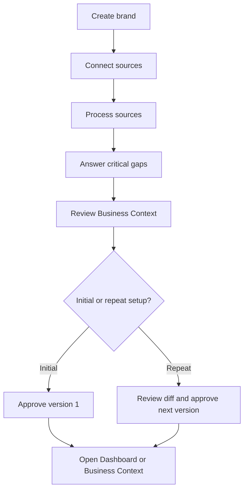
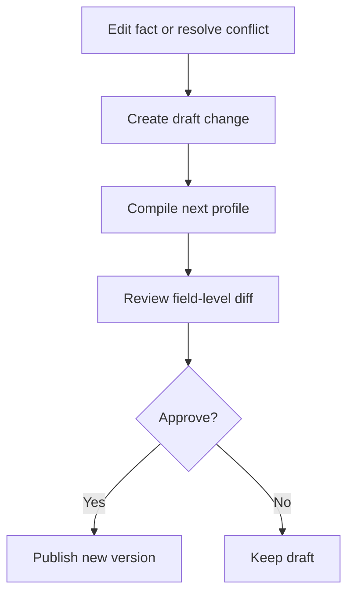
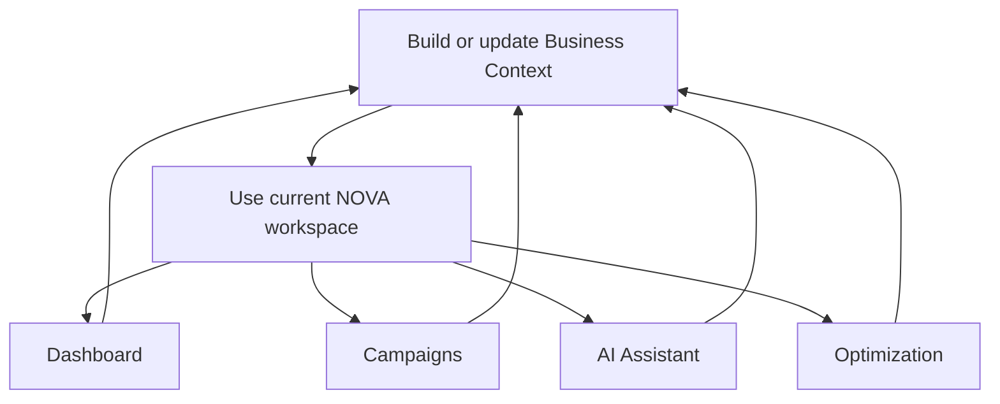

# PRD 007: Business Context Frontend

## 1. Objective

Build the frontend for creating Business Context v1 during onboarding and maintaining it after onboarding.

The frontend consumes the APIs and lifecycle defined in PRD 006. It must let NOVA learn from business sources, ask only necessary follow-up questions, obtain user approval and expose the approved context used by later campaign plans, recommendations and creative briefs.

## 2. Scope

### Included

- Single-brand onboarding flow
- Business creation
- Website source submission
- Brand document upload and classification
- Meta account connection entry point and status
- Asynchronous source-processing progress
- Dynamically generated gap and conflict questions
- Business Context review and approval
- Permanent Business Context page
- Fact editing with source evidence
- Source management
- Conflict resolution
- Draft comparison and approval
- Version history and restore flow
- Context readiness states and route guards
- First-time setup and repeat setup for existing users
- Responsive desktop interface

### Excluded

- Backend ingestion, extraction and persistence logic defined in PRD 006
- Firecrawl or PaddleOCR execution in the browser
- Shopify and CRM connections
- Competitor discovery
- Creative generation
- Hypothesis management
- Automatic Meta mutations
- Account and tracking audit UI or logic
- Mobile-native application

## 3. Current Repository Baseline

This PRD targets the current default branch of `naozitios/nova`, not the older PRD 005 architecture.

Current implementation:

- Next.js 16 App Router, React 19 and TypeScript
- Tailwind CSS 4, Radix UI components, Framer Motion and Lucide icons
- TanStack Query provided globally through `src/app/providers.tsx`
- Global `AuthProvider` and `Navbar` mounted from `src/app/layout.tsx`
- Demo authentication stored in `localStorage`; login currently routes to `/dashboard`
- Logged-in routes currently include Dashboard, Campaigns, AI Assistant, Optimization and Settings
- API route handlers live under `src/app/api/**/route.ts`
- Core services use ports and adapters through `src/di/container.ts`
- Campaign persistence defaults to an in-memory repository and can switch to Drizzle/libSQL
- `src/api/adClient.ts` still supplies mock account, asset and rule data to parts of the UI
- Meta OAuth and Graph API adapters exist; callback and account endpoints exist, but the Settings connect button is not yet wired to a complete connection flow
- PRD 006 introduces Supabase-backed Business Context separately and must be implemented before the integrated 007 experience can be complete

Implementation constraints:

- Do not replace or rewrite the existing campaign engine, AI Assistant, Optimization or Settings pages.
- Do not store Business Context in `adClient`, `campaignStore`, local storage, Drizzle/libSQL or another in-memory store.
- Add a dedicated typed client at `src/api/businessContextClient.ts` for PRD 006 endpoints.
- Use TanStack Query for Business Context reads, mutations, invalidation and processing-status polling.
- Add Business Context components under `src/components/business-context/`.
- Add onboarding components under `src/components/onboarding/`.
- Continue the current stone background, rounded-card, orange accent and responsive spacing system.
- Production Business Context requests require the server-authenticated workspace identity and RLS boundary defined by PRD 006. The current localStorage demo user must never be treated as backend authorisation.

## 4. Navigation

Preserve the current authenticated navigation and add Business Context:

1. Dashboard
2. Campaigns
3. AI Assistant
4. Optimization
5. Business Context
6. Settings

Business Context is a top-level destination because it directly governs NOVA's analysis, campaign planning and creative recommendations. It must not be buried under Settings.

Actions remain contextual within Dashboard, Campaigns, Optimization and Business Context. There is no separate Actions page.

## 5. Information Architecture

### Source layer

Raw evidence supplied to NOVA:

- Website pages
- Brand decks and playbooks
- Product documents
- Campaign briefs
- Research documents
- Connected Meta campaigns and creatives
- User answers and corrections

### Business Context layer

NOVA's structured and approved understanding of the brand:

- Business and offers
- Customers and decision-makers
- Conversion journey
- Economics and targets
- Brand, claims and proof
- Creative capacity
- Measurement and outcome sources

### Output layer

Products generated using an approved Business Context version:

- Campaign plans
- Performance recommendations
- Hypotheses
- Creative briefs
- Scaling actions

The UI must keep these layers distinct. Raw source documents never appear as approved truth without extraction, review and approval.

## 6. Entry Points and Onboarding Principles

The flow has two modes:

### Initial setup

- Used when the selected business has no approved Business Context.
- May be launched after first sign-in or from a Dashboard setup card.
- Approval publishes Business Context v1.

### Repeat setup

- Available to an existing user at any time from Business Context.
- Reuses the same source, question and review flow.
- The current approved profile remains active during the flow.
- New sources, answers and corrections create a draft next version.
- Completion publishes v2 or later only after diff review and approval.

Launch points:

- Dashboard setup/readiness card: `Set up Business Context` or `Continue setup`
- Business Context page primary CTA: `Update Business Context`
- Business Context overflow action: `Run setup again`
- Direct resumable onboarding URL for an authorised user

Do not automatically force every authenticated existing user into onboarding. Context-dependent features may show a blocking state, but Dashboard and Business Context remain accessible so the user can start or resume the flow deliberately.

Onboarding principles:

- Onboarding creates Business Context v1; it does not permanently complete the profile.
- Do not implement the eleven backend context sections as eleven form screens.
- Extract information from connected sources before asking the user to type it manually.
- Ask only questions caused by required gaps, material uncertainty or conflicts.
- Source processing must continue asynchronously while the user progresses.
- A failed source must not block usable sources from completing.
- The user approves one consolidated profile rather than approving every extracted fact individually.
- Material conflicts and required unknowns must remain visible before approval.
- One onboarding session represents one brand.
- Starting repeat setup must not create a second business.
- Only one active onboarding/update session may exist for the same business; reopening the flow resumes it.

## 7. Onboarding Flow



### Stage 1: Create Brand

Route: `/onboarding/business`

Required fields:

- Business or brand name
- Primary market
- Primary advertising objective
- Primary business outcome

Optional fields:

- Primary website
- Business type

Behaviour:

- In initial mode, create the business and onboarding session.
- In repeat mode, reuse the current business and create or resume an update session.
- If a website is supplied, register it as the first source and begin processing immediately.
- Persist progress on every successful field submission.
- Resume an incomplete onboarding session at its latest valid stage.

Primary CTA: `Continue`

### Stage 2: Connect Sources

Route: `/onboarding/sources`

Display source cards for:

- Website
- Meta ad account
- Brand decks and playbooks
- Other business documents
- Historical campaign material

Each source card shows:

- Connection or upload action
- Source type
- Status
- Latest processing activity
- Success, warning or failure summary
- Retry or remove action when allowed

Document upload requirements:

- Support PDF, DOC, DOCX, PPT and PPTX.
- Require the user to select a document class or accept NOVA's proposed class.
- Show upload progress independently for each file.
- Do not expose parser implementation details.

Processing begins when each source is added. The user may continue without waiting for every source to finish.

Primary CTA: `Continue while NOVA learns`

Secondary CTA: `Add another source`

### Stage 3: Processing and Critical Gaps

Route: `/onboarding/review`

This is one adaptive screen, not one screen per Business Context section.

Display:

- Overall processing status
- Sources completed, processing, partially completed or failed
- Facts extracted by section
- Questions ready to answer
- Clear indication when more questions may appear after processing

Question priority:

1. Primary conversion and downstream business outcome
2. Outcome source
3. Approximate monthly Meta budget
4. Target CPA, CPL or ROAS
5. Breakeven CAC or other economic constraint
6. Creative production capacity
7. Prohibited claims, topics or compliance rules
8. Material source conflicts

Supported controls:

- Single choice
- Multiple choice
- Currency or number
- Short text
- Long text
- Confirmation
- `I don't know`

Questions must come from the onboarding API. Do not hard-code one universal questionnaire for every business type.

The screen updates as background jobs complete without losing entered answers.

Primary CTA states:

- `Continue to review` when minimum context is ready
- `Save and return later` when required processing is incomplete
- Disabled with a reason when approval requirements cannot yet be met

### Stage 4: Review Business Context

Route: `/onboarding/context`

Display a consolidated summary of:

- Business and offers
- Customers and decision-makers
- Conversion journey
- Economics and targets
- Brand, claims and proof
- Creative capacity
- Measurement and outcome sources

Each section shows:

- Readiness state
- Important extracted values
- Missing required values
- Unresolved conflicts
- Edit action

Each expanded fact shows:

- Current proposed value
- Source name
- Source excerpt or evidence locator
- Verification status
- Confidence state
- Last update

Confidence must use user-facing states such as `Verified`, `Supported`, `Uncertain` and `Conflicting`. Do not make raw confidence scores the primary UI.

The user may edit material facts before approval. Edits create user-verified facts through the PRD 006 API and must not overwrite earlier evidence.

Primary CTA: `Approve Business Context`

### Stage 5: Approval and Handoff

Route: `/onboarding/complete`

After approval:

- Confirm Business Context v1 or the next approved version was created.
- Show the connected Meta account and source count.
- Let the user open Dashboard or return to Business Context.
- Preserve the selected business and approved context version.

Primary CTA in initial mode: `Open Dashboard`

Primary CTA in repeat mode: `Return to Business Context`

If Meta is not connected, approval may still complete when PRD 006 requirements are satisfied. Show `Connect Meta` as a separate next setup action. Audit behaviour is deferred to a later PRD.

## 8. Onboarding Shell

All onboarding routes use a dedicated shell containing:

- NOVA logo
- Current brand name
- Five-stage progress indicator
- Save state
- Exit and resume later action
- Contextual help

Progress stages:

1. Brand
2. Sources
3. Critical gaps
4. Review
5. Complete

The current root layout always renders `Navbar`. Update `src/components/Navbar.tsx` to omit the global navbar when `pathname.startsWith('/onboarding')`; do not restructure the entire application shell for this PRD.

Existing users can exit repeat setup without publishing. Their current approved Business Context remains active.

## 9. Business Context Page

Route: `/business-context`

### Page header

- Page title: `Business Context`
- Current version
- Approval state
- Last updated
- Primary CTA based on state: `Set up Business Context`, `Continue setup`, `Update Business Context`, `Review changes` or `Approve update`

### Summary

Display:

- Overall context readiness
- Current approved version
- Draft change count
- Connected and uploaded source count
- Required gaps
- Unresolved conflicts
- Recent changes
- Tasks affected by missing context

When no approved profile exists, show an empty-state setup card instead of redirecting away from the page. Its CTA launches initial setup.

### Context sections

- Business and offers
- Customers
- Conversion journey
- Economics and targets
- Brand, claims and proof
- Creative capacity
- Measurement and outcome sources

Each section supports:

- Summary view
- Expandable fields
- Inline edit
- Evidence drawer
- Verification state
- Missing and conflicting state

### Sources

Display all active and archived sources with:

- Source name and type
- Processing state
- Added date
- Effective date where available
- Extracted fact count
- Warning or error state
- Inspect, reprocess and archive actions

Source inspection opens a drawer or detail page showing metadata, processing warnings and evidence excerpts. For page-, slide- or bounding-box evidence, link to the exact available location.

### Conflicts

Display one conflict card per fact key:

- Conflicting values
- Source and effective date for each value
- NOVA's proposed value when available
- Targeted resolution question
- Resolution note

Resolving a conflict creates a draft change. It does not publish immediately.

### Version history

Display:

- Version number
- Status
- Approved by
- Approval date
- Change summary
- View version action
- Compare action
- Restore action for authorised roles

Restoring an older version must clearly state that NOVA will create a new version from that snapshot rather than delete later history.

## 10. Editing and Approval Flow



Requirements:

- The current approved profile remains unchanged while edits are in draft.
- Show a persistent draft-change indicator.
- `Review changes` opens a field-level diff grouped by context section.
- The diff shows previous value, proposed value, source and reason.
- Only authorised roles see approval and restore actions.
- Failed approval leaves the current version and draft intact.

## 11. General NOVA Product Flow



### First-use journey

```text
Create brand
→ Connect Meta and business sources
→ Review and approve Business Context v1
→ Open Dashboard or Business Context
```

### Existing-user refresh journey

```text
Open Business Context
→ Click Update Business Context or Run setup again
→ Add new sources or reprocess existing sources
→ Answer new gaps and conflicts
→ Review changes against the current version
→ Approve the next version
→ Return to Business Context
```

### Daily journey

```text
Open Dashboard
→ Review performance summary
→ Review important callouts
→ Inspect evidence
→ Approve, edit or dismiss recommended actions
→ Deep-dive into the affected campaign when required
```

### Weekly planning journey

```text
Review weekly diagnosis
→ Understand what changed and why
→ Review winning and weak creative concepts
→ Select the next hypothesis
→ Generate a creative brief
→ Upload completed creatives
→ Add them to the correct campaign or ad set
→ Track whether the hypothesis was supported
```

Business Context is used throughout these journeys. Recommendations, hypotheses and briefs must expose which Business Context version they used.

Audit, campaign-planning, hypothesis and scaling flows are defined by later PRDs. This PRD only makes the approved Business Context available to those features.

## 12. Readiness and Route Behaviour

### No Business Context

- Keep Dashboard and Business Context accessible.
- Show a setup card with `Set up Business Context`.
- Context-dependent features must explain that Business Context is required and link into initial setup.

### Processing

- Allow onboarding and source management.
- Show live progress and partial results.
- Do not represent partial extraction as approved context.

### Awaiting answers or review

- Allow access to the review flow.
- Show blocking questions and conflicts.
- Keep approval disabled until backend requirements are satisfied.

### Approved without Meta

- Allow Business Context access.
- Provide a direct Meta connection action.

### Approved with Meta

- Allow the user to return to Dashboard or remain in Business Context.
- Enable downstream workflows according to their own readiness requirements.

### Existing user starts repeat setup

- Keep the current approved version active.
- Resume an existing update session if one is already active.
- Do not block Dashboard or other existing routes.
- Publish changes only after diff review and approval.

## 13. State and API Integration

Use the PRD 006 endpoints as the only source of persisted state.

Frontend requirements:

- Do not add mock or in-memory persistence for Business Context.
- Poll or subscribe to onboarding and job status while processing is active.
- Stop polling terminal job states.
- Use idempotency keys for all mutating requests.
- Preserve unsent form values during temporary network failure.
- Revalidate the current onboarding or profile state after mutations.
- Handle stale-version conflicts by refreshing the current draft and asking the user to review changes again.
- Never call Firecrawl, PaddleOCR or Supabase service-role operations directly from the client.
- Do not use `AuthContext.user` or its localStorage payload as proof of workspace membership.
- Do not add Business Context methods to `adClient` or `campaignStore`.
- Use query keys scoped by business ID and context version.
- Redirect Meta connection through the existing server-side Meta OAuth boundary once its connect route is completed; do not expose Meta credentials in client code.

## 14. Core UI Components

- `OnboardingShell`
- `OnboardingProgress`
- `SourceCard`
- `SourceUploader`
- `SourceProcessingList`
- `DynamicQuestionForm`
- `ContextReadinessSummary`
- `ContextSectionCard`
- `ContextFactRow`
- `EvidenceDrawer`
- `ConflictCard`
- `ProfileDiff`
- `VersionHistoryList`
- `ApprovalDialog`
- `BlockingState`
- `InlineError`

Components must consume typed API contracts. Do not duplicate backend fact-resolution logic in React components.

## 15. Loading, Empty and Error States

### Loading

- Use section-level skeletons rather than blocking the entire page.
- Show determinate upload progress where available.
- Show named processing stages without exposing internal providers.

### Empty

- No sources: explain what NOVA can learn and provide source actions.
- No questions: explain that NOVA has enough information for the current stage.
- No conflicts: show a simple resolved state.
- No draft changes: hide approval controls.

### Errors

- Failed source processing affects only that source.
- Show retry only for retryable errors.
- Preserve successfully extracted information from other sources.
- Explain unsupported or rejected files clearly.
- Authentication or authorisation failures must not expose business data.

## 16. Accessibility

- All stages and status changes must be understandable without colour.
- Progress indicators expose accessible labels and current stage.
- Drawers and dialogs trap focus and return focus on close.
- Evidence and diff views support keyboard navigation.
- Upload controls support keyboard selection and clear validation messages.
- Dynamic processing updates use non-disruptive live regions.

## 17. Analytics Events

Track:

- `onboarding_started`
- `business_created`
- `source_added`
- `source_upload_started`
- `source_upload_completed`
- `source_processing_failed`
- `meta_connection_started`
- `meta_connection_completed`
- `onboarding_question_answered`
- `context_review_opened`
- `business_context_approved`
- `onboarding_completed`
- `business_context_setup_reopened`
- `context_fact_edited`
- `context_conflict_resolved`
- `context_draft_reviewed`
- `context_version_approved`
- `context_version_restored`

Do not send source contents, answers, evidence excerpts or business-sensitive values in analytics payloads.

## 18. Acceptance Criteria

- A user can create one brand and begin onboarding.
- The onboarding UI uses five stages rather than one screen per Business Context section.
- A user can add a website, connect Meta and upload supported documents from one source stage.
- Every source displays an independent asynchronous processing state.
- The user can continue while sources process.
- Questions are rendered from the backend and are limited to material gaps, uncertainty and conflicts.
- The user can review the complete proposed Business Context by section.
- Every material fact can expose its source, excerpt and verification state.
- User edits preserve earlier evidence and appear as draft changes.
- Initial approval creates Business Context v1 and returns the user to Dashboard or Business Context.
- An existing user can launch the same guided flow from Business Context at any time.
- Repeat setup reuses the current business, preserves the current approved profile and creates a draft next version.
- Business Context is available as a permanent top-level navigation destination.
- The Business Context page supports overview, sections, sources, conflicts and version history.
- Later edits require a diff and approval before becoming current.
- Route states distinguish no context, processing, awaiting review, approved without Meta and approved with Meta.
- No frontend path bypasses the PRD 006 approval or authorisation rules.
- No Business Context state relies on mock or in-memory persistence.
- The implementation preserves the current Dashboard, Campaigns, AI Assistant, Optimization and Settings routes.
- Business Context uses a dedicated API client and TanStack Query rather than `adClient`, `campaignStore` or localStorage.
- The global Navbar is hidden only for `/onboarding/**` routes.
- No audit UI, audit trigger or audit engine is implemented by this PRD.

## 19. Delivery Order

### Phase 1: Onboarding shell and brand creation

- Add routes and route guards.
- Add the dedicated Business Context API client and query keys.
- Update the current Navbar without removing existing destinations.
- Build onboarding shell and resume behaviour.
- Implement initial and repeat setup modes.

### Phase 2: Sources and processing

- Build source cards and uploads.
- Add Meta connection status.
- Add processing progress, partial success and retry states.

### Phase 3: Questions, review and approval

- Render dynamic questions.
- Build consolidated Business Context review.
- Add evidence inspection, edit and approval.
- Add Dashboard and Business Context handoff.

### Phase 4: Permanent Business Context page

- Add the top-level navigation item.
- Build overview and section editing.
- Build sources and conflicts.
- Build draft diff, approval and version history.
- Add `Update Business Context` and `Run setup again` entry points.

### Phase 5: Hardening

- Add role-based actions.
- Add analytics events.
- Complete accessibility and responsive behaviour.
- Test failure, resume and stale-version states.

## 20. Final Boundary

PRD 006 owns Business Context ingestion, storage, resolution, versioning, authorisation and APIs.

PRD 007 owns the user experience for supplying sources, answering critical gaps, reviewing evidence, approving Business Context and maintaining it as the living business profile used throughout NOVA.

Account and tracking audits are intentionally excluded and must be specified in a later PRD.
