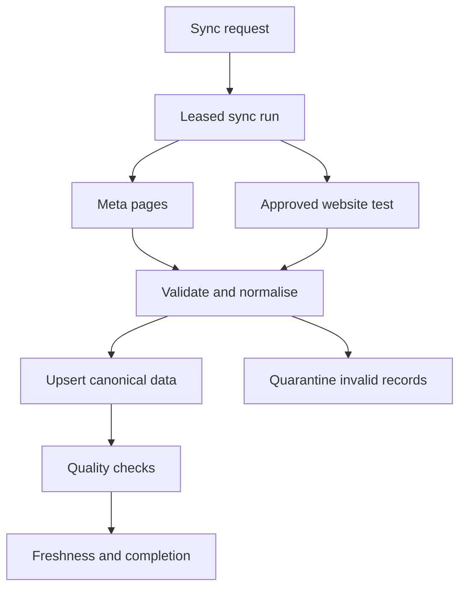

# PRD 008: Meta Data Foundation

## 1. Objective

Build NOVA's reliable Meta data foundation: a secure, workspace-scoped Meta connection plus a resumable pipeline that reads, normalises and stores the full advertising hierarchy and daily performance data in Supabase.

This is NOVA's **eyes**. PRD 008 does not diagnose performance or recommend actions. It makes later analysis trustworthy.

## 2. Position in the Product Sequence

| PRD | Responsibility |
|---|---|
| 006 | Stores approved Business Context and its evidence/version history |
| 007 | Lets users create and maintain that context |
| **008** | Connects Meta and creates a durable, quality-checked advertising dataset |
| 009 | Audits account and tracking setup using 006 + 008 |
| 010 | Explains performance and recommends next actions using 006 + 008 + 009 |

PRDs 006 and 007 are assumed implemented. Their workspace, business, membership, RLS, background-job and Business Context contracts are dependencies, not duplicated here.

## 3. Current Repository Baseline

This PRD targets the current default branch of `naozitios/nova`, including:

- Next.js 16 App Router, React 19, TypeScript and Tailwind CSS 4
- TanStack Query mounted through `src/app/providers.tsx`
- API route handlers under `src/app/api/**/route.ts`
- Ports/adapters composed through `src/di/container.ts`
- Existing `MetaOAuthAdapter` and `MetaApiAdapter`
- Existing OAuth callback and account endpoints
- Existing Dashboard, Optimization and Settings surfaces

The current Meta and analytics implementation is only a prototype:

- OAuth state is not yet a complete secure, persistent workspace connection.
- Access token and the first returned ad account are stored in cookies.
- The first ad account is selected automatically instead of by the user.
- The Settings connection button is not wired end to end.
- Analytics routes fetch Meta directly and may return mock data.
- Configuration can incorrectly be used as a token/account fallback.
- Time-series records are assigned today's date instead of their Meta reporting date.
- Campaign-level data exists, but durable campaign, ad set, ad, creative and daily ad-level storage does not.
- There is no resumable sync state, rate-limit control, freshness contract or persistent error history.

Implementation must extend the existing architecture. It must not create a second frontend stack or bypass the DI boundary.

## 4. Product Outcome

An authorised workspace member can:

1. Connect or reconnect Meta securely.
2. Choose which accessible ad account belongs to a NOVA business.
3. See connection and data-freshness status.
4. Start an initial backfill or incremental refresh.
5. Leave and return while processing continues.
6. Retry failed work without duplicating stored data.
7. Disconnect an account without deleting historical analysis records.
8. See which Meta and measurement capabilities NOVA can and cannot verify for the selected account.
9. Run a safe website measurement verification separately from the Business Context website crawl.

NOVA can reliably answer:

- Which Meta objects exist and how are they related?
- What were the daily results for each ad?
- When was each dataset last synchronised?
- Which records are complete, partial, stale or unavailable?
- Which source, API version and sync run produced each stored record?
- Which PRD 009 audit checks have enough evidence to run?
- Is tracking evidence from Meta, a live browser observation, a user confirmation or a deeper integration?

## 5. Scope

### Included

- Secure Meta OAuth start, callback, reconnect and disconnect
- Cryptographically verified OAuth state
- Server-side token storage scoped to a workspace connection
- Explicit ad-account selection and business association
- Account, campaign, ad set, ad and creative metadata ingestion
- Daily ad-level insights and required rollups
- Version-controlled Meta endpoint, field, permission and consumer registry
- Capability discovery for each connection and selected ad account
- Available pixel, dataset, event, CAPI, diagnostic and Event Match Quality evidence required by PRD 009
- Audit dependency matrix mapping every PRD 009 rule to its PRD 008 evidence requirements
- Safe browser-based website measurement verification for Pixel events, parameters, consent states, redirects and landing-page tracking
- Explicit evidence-source and observability states for Meta-side, browser-side and integration-side facts
- Configurable historical backfill, defaulting to 90 complete days
- Incremental and on-demand synchronisation
- Pagination, checkpointing, retry, backoff and partial success
- Data validation, deduplication and quarantine of invalid payloads
- Connection health and data-freshness APIs
- RLS and service-role boundaries
- Local Supabase CLI workflow for schema, policies, seed data, generated types and functions

### Excluded

- Performance diagnosis or recommendations
- Account/tracking audit logic
- Automatic Meta mutations
- Campaign creation or optimisation execution
- CRM, Shopify or offline revenue ingestion
- Hypotheses, experiments and creative briefs
- ML models or warehouse infrastructure
- Full verification of private customer server code, raw CAPI payloads, CRM delivery or downstream revenue without a later first-party integration
- Automatic submission of real lead, checkout or purchase forms during website verification

### Evidence ownership boundary

PRD 008 collects, validates and stores measurement evidence. PRD 009 decides whether that evidence passes an audit rule.

For example, PRD 008 may store:

```text
Expected conversion event: Lead
Meta optimization event: Lead
Browser journey observed: PageView only
Meta dataset reports: server Lead activity
Deduplication status: not_observable
```

PRD 009 may then conclude that the browser Lead event was not observed and browser/server deduplication could not be verified. PRD 008 itself does not label the setup healthy or unhealthy.

The PRD 006 website crawl remains a Business Context source. Website measurement verification is a separate PRD 008 job that executes JavaScript and observes runtime tracking behaviour. It may reuse the approved website URL, but it must not reuse content-crawl results as proof that tracking works.

## 5.1 Meta Data Coverage Contract

PRD 008 must not attempt to collect every field Meta exposes. It must collect every justified field required by a current downstream contract while preserving selected raw payloads needed for safe remapping.

A version-controlled registry defines each required field or observation:

- Stable contract ID and version
- Downstream consumer: PRD 009 audit rule, PRD 010 feature or operational UI
- Meta object, edge/endpoint and requested fields
- Required Graph API version
- Required app review feature and user/system permission
- Expected data grain and natural key
- Initial and refresh cadence
- Maximum acceptable staleness
- Validation and normalisation rule
- Whether absence means `not_present`, `not_returned`, `permission_denied`, `unsupported` or `not_observable`
- Fallback evidence source, if one exists
- Synthetic and provider-contract test fixture

The registry is reviewed with every Meta API version upgrade. A field cannot be silently removed because an API request still returns HTTP 200.

### Initial audit dependency matrix

| PRD 009 audit question | Required PRD 008 evidence | Primary source | Fallback/limitation |
|---|---|---|---|
| Is the connection readable? | Token verification, granted scopes, account capability result | Meta API | Reconnect required when permission is revoked |
| Is data fresh and complete? | Sync coverage, checkpoints, failed partitions and insight cutoff | NOVA sync state | No inference from a successful connection alone |
| Is a pixel/dataset associated? | Pixel/dataset identity and account/business relationship | Meta API | `not_observable` when permissions do not expose it |
| Are required events reaching Meta? | Event activity/last-seen evidence where exposed | Meta dataset/pixel API or diagnostics | May require guided Events Manager verification |
| Is CAPI active? | Server-event evidence and Meta diagnostics where exposed | Meta dataset diagnostics | Does not prove private server implementation is correct |
| Is Event Match Quality observable? | Dataset EMQ diagnostic records | Meta EMQ diagnostics | `not_observable` when unavailable; never guessed |
| Are browser and server events deduplicated? | Meta diagnostic evidence plus matching browser `event_id` observation | Meta diagnostics + website test | Full proof may require first-party integration/test event |
| Does the Pixel load on the live site? | Pixel request, pixel ID and page URL | Website browser test | Test result is page/device/consent-state specific |
| Do conversion events fire at the right step? | Safe journey observation and emitted event parameters | Website browser test | Real form/purchase submission requires explicit test mode or user action |
| Are UTMs retained? | Configured ad URL parameters, redirect chain and final URL | Meta ad data + website test | Server-side attribution beyond landing page is deferred |
| Does the Meta optimization event match the business outcome? | Promoted object/optimization event plus approved Business Context field | Meta API + PRD 006 | PRD 009 evaluates alignment |

Every executable PRD 009 rule must name its contract IDs. CI fails when a rule requires an unregistered field or when a required registry entry has no adapter/test coverage.

## 6. Meta Connection Model

### Connection lifecycle

```text
pending -> connected -> degraded -> reconnect_required -> disconnected
```

- `pending`: OAuth has started but no valid connection is stored.
- `connected`: the token is valid and at least one permitted ad account is readable.
- `degraded`: some reads fail, permissions are incomplete or the API is temporarily unavailable.
- `reconnect_required`: the token is expired, revoked or missing required permissions.
- `disconnected`: the user deliberately deactivated the connection.

OAuth requirements:

- Generate a short-lived, single-use, signed state value bound to the initiating user, workspace and return path.
- Reject expired, replayed or mismatched state.
- Exchange tokens only on the server.
- Never expose access tokens to browser JavaScript, Business Context records, application logs or analytics events.
- Store token ciphertext or a reference to an approved secret store. Encryption keys must not be stored in the database.
- Record granted scopes, token expiry when available, last verification time and reconnect reason.
- Do not silently select an ad account. Present eligible accounts and require explicit selection.
- A Meta ad account can be associated with only one active NOVA business inside a workspace unless a later tenancy decision explicitly permits sharing.

NOVA operates one reviewed Meta Developer App. Clients normally connect through OAuth; they do not create their own Meta app. The connection UI must explain that the authorising person needs suitable access to the requested ad account, business assets, pixel or dataset. Missing access becomes a capability result with an administrator recovery instruction.

Disconnecting archives the active connection and stops new syncs. It does not cascade-delete historical Meta objects, insight snapshots, audits or dashboard outputs.

## 7. Canonical Data Model

All tenant-owned rows include `workspace_id`, use UUID primary keys, have `created_at` and `updated_at`, and are protected by RLS.

| Table | Purpose | Important constraints |
|---|---|---|
| `meta_connections` | OAuth connection and encrypted credential reference | One active connection per provider identity/workspace |
| `meta_api_capabilities` | Per-connection/account result for each registered capability | Unique connection + account + contract/capability version |
| `meta_ad_accounts` | Selected and accessible ad accounts | Unique connection + Meta account ID |
| `meta_campaigns` | Canonical campaign metadata | Unique ad account + Meta campaign ID |
| `meta_ad_sets` | Canonical ad-set metadata | Unique ad account + Meta ad-set ID |
| `meta_ads` | Canonical ad metadata | Unique ad account + Meta ad ID |
| `meta_creatives` | Creative metadata and asset references | Unique ad account + Meta creative ID |
| `meta_tracking_sources` | Pixel/dataset identities, relationships and observable metadata | Store unavailable fields explicitly |
| `meta_tracking_observations` | Versioned event, CAPI, attribution and diagnostic evidence | Evidence source, observed time, scope and observability required |
| `meta_dataset_diagnostics` | Redacted provider diagnostic and EMQ records where available | Provider ID/type + observation window; no user identifiers |
| `website_measurement_runs` | Authorised browser-verification request, scope and outcome | Bound to business, approved domains and test policy |
| `website_measurement_observations` | Pixel requests, events, parameters, consent state and redirects | Redacted allowlisted fields only |
| `meta_insights_daily` | Daily ad-grain facts and raw action values | Unique account + ad + date + attribution setting |
| `meta_sync_runs` | Requested sync, state, inputs and outcome | Idempotency key and leased worker ownership |
| `meta_sync_checkpoints` | Cursor/date/object progress | Unique run + sync partition |
| `meta_sync_attempts` | Attempt timing, provider response and retry decision | Append-only |
| `meta_quarantined_records` | Invalid payloads safe for later inspection | Redacted payload, validation errors and source |

Object tables store Meta IDs as strings, parent IDs, name, effective status, configured status, objective/type fields, budget fields where applicable, provider timestamps, `first_seen_at`, `last_seen_at`, `archived_at`, `raw_metadata_json` and the producing `meta_sync_run_id`.

`meta_insights_daily` stores:

- `date_start` and `date_stop` from Meta; never the local ingestion date
- account, campaign, ad set and ad IDs
- spend, impressions, reach, frequency, clicks, link clicks and landing-page views when returned
- raw `actions` and `action_values` JSON
- normalised result, conversion and value fields only when mapping is deterministic
- attribution setting and account timezone
- currency
- data completeness state
- producing sync run and API version

Raw action arrays are preserved so later mappings can be corrected without re-fetching when possible. Monetary values use exact numeric types, not floating-point arithmetic.

Tracking observations use one of these evidence sources:

```text
meta_api
meta_diagnostics
website_browser_test
user_verified
integration_verified
```

Observability is recorded independently:

```text
observed
not_present
not_returned
permission_denied
unsupported
not_observable
error
```

`not_present` is valid only when the source could authoritatively observe the fact and confirmed its absence. It must not be used for missing permissions or unsupported fields.

## 8. Synchronisation Pipeline



### Sync modes

| Mode | Behaviour |
|---|---|
| `initial_backfill` | Hierarchy plus configurable history; default 90 complete days |
| `incremental` | Objects changed since the checkpoint and recent insight dates subject to restatement |
| `manual_refresh` | User-requested incremental run using the same safeguards |
| `repair` | Replays an explicit failed partition or date range |
| `capability_discovery` | Verifies registered endpoints, fields, permissions and asset access |
| `tracking_refresh` | Refreshes pixels/datasets, event activity, CAPI and available diagnostics |

The incremental lookback must be configurable because Meta can restate recent data. The pipeline stores the latest canonical record while preserving run provenance.

### Work partitions

Partition work by ad account, object type, capability/diagnostic family and bounded date window. A failed insight or tracking partition must not force completed hierarchy or date windows to run again.

### Run states

```text
queued
running
partially_succeeded
succeeded
retry_scheduled
failed
cancelled
```

Each run has a lease owner, lease expiry and heartbeat. A worker may reclaim an expired lease. Upserts and checkpoints make replay safe.

Use the background-job conventions introduced by PRD 006. Do not create a second incompatible retry system. Next.js route handlers enqueue and inspect work; they do not hold a request open for the full backfill.

Supabase Edge Functions may handle short, idempotent orchestration tasks. Long backfills run in a durable background worker because they can exceed request/function lifetimes.

### Capability discovery

Capability discovery runs after OAuth/account selection, after reconnect, after a permission change and after a Meta API upgrade. It probes only registered read contracts and records:

- Available and verified
- Available but empty
- Permission/app-review blocked
- Asset access missing
- Unsupported by the configured API version
- Provider error

An empty result is not automatically a missing asset. The adapter must distinguish a successful authoritative empty response from a field omitted because it was not requested or accessible.

The discovery result controls downstream scheduling. NOVA does not repeatedly call a permission-blocked endpoint on every sync; it shows the recovery requirement and rechecks after reconnect or an explicit retry.

## 8.1 Website Measurement Verification

Meta-side evidence shows what Meta received or exposes. It does not prove that the live website loads the correct Pixel, fires events at the intended journey step or retains tracking parameters through redirects.

The browser verifier runs separately from the PRD 006 content crawl and can observe:

- Final URL and redirect chain
- Meta Pixel network requests and pixel/dataset identifiers visible in the browser
- Standard/custom event names
- Allowlisted non-sensitive parameters such as value, currency, content type and `event_id`
- Duplicate event/request counts within the same tested step
- Consent state and whether events fire before or after consent
- Presence of `_fbp`/`_fbc` where legally permitted and relevant
- UTM and click-identifier retention through the landing-page redirect
- Page/device/test-step provenance

The verifier cannot directly inspect private server-to-server CAPI requests. CAPI assessment combines Meta-provided server-event/diagnostic evidence with browser observations and, when later available, first-party integration evidence.

### Safe test policy

- Test only a domain verified for the selected business or explicitly authorised by an approved workspace member.
- Resolve and validate every URL/redirect to prevent SSRF, private-network access and unsafe schemes.
- Use bounded page, redirect, interaction and execution limits.
- Default to passive page loads and non-destructive interactions.
- Never submit a real lead, purchase, booking, payment or account-creation action without an explicit isolated test mode and user confirmation.
- Do not bypass authentication, consent or bot controls.
- Redact emails, phone numbers, names, addresses, form contents and other user data from observations and logs.
- Store only allowlisted tracking fields needed by registered audit contracts.
- Record viewport/device, consent choice, journey step, timestamp and exact test limitation.

A single successful page test does not prove site-wide tracking health. Results are scoped to the pages, device profile, consent state and journey steps actually tested.

## 9. Robustness and Quality Controls

### Retry policy

- Retry transient network failures, 429s and eligible 5xx responses with exponential backoff and jitter.
- Respect Meta retry and usage headers when available.
- Do not retry authentication, permission or schema-validation failures indefinitely.
- Set per-partition attempt limits and an overall run deadline.
- Open a temporary circuit breaker after repeated provider failures to avoid a retry storm.
- Preserve the last error, provider request identifier, safe response metadata and next retry time.

### Idempotency

- Client sync requests accept or create an idempotency key.
- Only one active initial/incremental sync may exist for the same account and compatible range.
- Canonical rows use stable provider-derived unique constraints.
- Checkpoint advancement and the corresponding data write occur transactionally where practical.

### Quality checks

Every partition is checked for:

- Required IDs and parent relationships
- Valid reporting dates and `date_start <= date_stop`
- Currency and timezone consistency within an account
- Non-negative count and monetary metrics where the field definition requires it
- Duplicate natural keys
- Orphaned ad sets or ads
- Missing requested dates versus legitimate no-delivery dates
- Material discrepancies between stored rollups and the underlying ad-grain facts
- Unexpected provider schema changes
- Contract fields omitted from otherwise successful provider responses
- Capability changes since the prior discovery run
- Pixel/dataset IDs that conflict between Meta configuration and browser observations
- Duplicate browser events within one tested journey step
- Missing or malformed allowlisted measurement parameters
- Diagnostic records outside their stated observation window

Quality results are `passed`, `warning`, `failed` or `not_observable`. Warnings can allow partial success; failed records are quarantined and do not poison canonical tables.

Missing data is never converted to zero unless the Meta contract explicitly defines it as zero. Unsupported or inaccessible tracking fields use the explicit observability states defined in Section 7; they are never inferred.

The quality layer validates evidence; it does not convert an observation into an audit pass/fail result. That decision remains in PRD 009.

## 10. API Contracts

All endpoints resolve authenticated workspace membership on the server and never trust a browser-supplied `workspace_id` without authorisation.

| Method and route | Purpose |
|---|---|
| `POST /api/meta/oauth/start` | Create verified OAuth state and return the provider authorisation URL |
| `GET /api/meta/oauth/callback` | Verify state, exchange token and create/update connection |
| `GET /api/meta/connections` | List connection health for the selected workspace |
| `DELETE /api/meta/connections/:connectionId` | Archive the connection and stop future syncs |
| `GET /api/meta/ad-accounts` | List eligible and selected accounts |
| `POST /api/meta/ad-accounts/:accountId/select` | Associate an account with a business |
| `POST /api/meta/sync` | Enqueue an idempotent sync |
| `GET /api/meta/sync/:runId` | Return run, checkpoints, progress and safe errors |
| `POST /api/meta/sync/:runId/retry` | Retry failed partitions |
| `GET /api/meta/data-freshness` | Return object/insight coverage and latest successful dates |
| `GET /api/meta/capabilities` | Return registered capability, permission and asset-access results |
| `GET /api/meta/tracking` | Return authorised tracking sources, observations and freshness |
| `POST /api/meta/tracking/refresh` | Enqueue an idempotent Meta-side tracking refresh |
| `POST /api/meta/measurement/verify` | Enqueue a safe website measurement run for an approved scope |
| `GET /api/meta/measurement/runs/:runId` | Return website verification progress, observations and limitations |
| `GET /api/meta/objects` | Query the stored hierarchy with typed filters |
| `GET /api/meta/insights` | Query stored daily insight facts |

The current `/api/analytics` and `/api/analytics/timeseries` routes must either become compatibility facades over the Supabase query service or be removed after callers migrate. They must not fetch live Meta data or return mock success data for a connected business.

## 11. Repository Architecture

Suggested boundaries:

```text
src/core/meta-data/
  entities.ts
  data-contract-registry.ts
  audit-dependency-matrix.ts
  ports.ts
  sync-policy.ts
  services.ts
src/infrastructure/meta/
  meta-api-adapter.ts
  meta-oauth-adapter.ts
  supabase-meta-repository.ts
  token-vault.ts
  website-measurement-adapter.ts
src/workers/meta-sync/
src/workers/website-measurement/
src/api/metaClient.ts
src/components/settings/meta-connection/
```

- Core code cannot import Next.js, Supabase clients or provider SDKs.
- Expand the existing Meta adapters rather than introducing a parallel provider layer.
- Register repositories, services and workers through `src/di/container.ts`.
- Frontend reads use TanStack Query and typed clients.
- Server-side repositories use the authenticated Supabase client for user reads and a narrowly scoped service client only inside trusted workers.
- Generate database types locally and commit the generated application type file if that is the repository convention.
- Keep the Meta data contract registry and PRD 009 dependency matrix version-controlled and testable; do not bury them in route handlers.
- Browser verification runs in an isolated worker/runtime with strict network and interaction policies.

The Meta Graph API version is configuration, not a scattered constant. Implementation targets a currently supported Meta version and tests the upgrade boundary. As of this PRD, the current Meta Marketing API version is v25.0; production upgrades still require explicit compatibility testing.

## 12. Local Supabase CLI Workflow

All Supabase changes are created and verified locally first. No required schema, RLS, Storage, Auth, seed or function configuration may exist only as a manual Dashboard change.

Required workflow:

1. `supabase start`
2. Create timestamped files under `supabase/migrations/` for tables, indexes, constraints, RLS and grants.
3. Put repeatable development fixtures in `supabase/seed.sql`; never put production credentials or real Meta tokens in seeds.
4. Run `supabase db reset` to prove a clean database can be reproduced from migrations and seed data.
5. Run RLS and repository integration tests against the local stack.
6. Run `supabase gen types typescript --local` and update the application's generated database types.
7. Serve any short Supabase functions locally with `supabase functions serve`.
8. Keep secrets in ignored local environment files; manage deployed secrets through approved CLI/CI commands.
9. Apply reviewed migrations through one controlled CI/deployment path using `supabase db push`.

Migration rollback is forward-fix by default. Destructive migrations require an explicit data-migration and recovery plan.

## 13. Security and Privacy

- RLS policies use workspace membership and role checks from PRD 006.
- Browser clients cannot read token ciphertext, provider secrets, raw provider errors or quarantined sensitive payloads.
- Service-role keys are server/worker only.
- Logs redact tokens, signed state, user data and raw payload fields that may contain sensitive information.
- Audit connection creation, reconnect, account selection, disconnect, manual sync and retry events.
- Rate-limit user-triggered sync and OAuth-start endpoints.
- Validate all provider payloads at the adapter boundary.
- Validate approved website domains, DNS resolutions and every redirect before browser navigation.
- Store only allowlisted measurement parameters; never persist observed form values or unnecessary user identifiers.
- Treat website verification as potentially hostile external content and isolate its browser execution from application secrets and internal networks.

## 14. Observability

Track at minimum:

- Connection success, reconnect and permission failure rate
- Sync queue delay and duration
- Pages and records read/upserted/quarantined
- Retry count by reason
- Rate-limit and circuit-breaker events
- Freshness lag by account and dataset
- Missing-date and hierarchy-integrity warnings
- Stuck or reclaimed leases
- Capability availability and permission/app-review failures by contract
- Tracking/diagnostic freshness by source
- Website verification completion, blocked navigation and redaction counts
- Meta API contract drift after version or field changes

User-facing errors explain what can be done next without exposing provider internals.

## 15. Acceptance Criteria

- A user can securely connect Meta, explicitly select an account and reconnect or disconnect it.
- Clients connect through NOVA's reviewed Meta Developer App and are not required to create their own Meta app.
- Tokens are not stored in cookies or exposed to the browser.
- A clean local Supabase stack can be built entirely from committed migrations and seeds.
- The full account → campaign → ad set → ad → creative hierarchy is persisted with stable IDs and parent relationships.
- Daily ad-level insights use real Meta reporting dates, account timezone and currency.
- The initial 90-day backfill can resume after a worker or provider failure.
- Duplicate requests and retries do not create duplicate canonical or insight rows.
- Invalid records are quarantined with evidence; valid partitions can still complete.
- Data freshness and partial coverage are visible to users and downstream services.
- Missing/unavailable provider data is not guessed or silently converted to fake values.
- Every PRD 009 rule identifies versioned PRD 008 contract IDs, and CI rejects unregistered dependencies.
- Capability discovery distinguishes available, empty, permission-blocked, unsupported and failed data sources.
- Pixel/dataset, event, CAPI and EMQ diagnostic evidence is collected where the connected account and Meta API permissions expose it.
- CAPI activity or diagnostics are never presented as proof that private server implementation is fully correct.
- A safe website measurement run can verify the Pixel ID, browser events, duplicate firing, allowlisted parameters, consent timing, redirects and URL-parameter retention for approved test pages.
- The website verifier cannot access private networks, leak application secrets or store form/user data.
- Website measurement results state their tested pages, journey steps, device, consent state and limitations.
- `not_present` is used only for authoritative absence; inaccessible or unsupported facts remain explicitly not observable.
- Current mock analytics fallbacks and configuration-as-token/account fallbacks are removed.
- Existing App Router, TanStack Query, DI and visual conventions are preserved.
- No Meta write action is introduced by this PRD.

## 16. Delivery Slices

1. Local Supabase schema, RLS, repositories, generated types and versioned data-contract registry
2. Secure connection lifecycle, explicit account selection and capability discovery
3. Hierarchy ingestion with checkpoints and quality validation
4. Daily ad-level insight backfill and incremental sync
5. Pixel/dataset, event, CAPI, diagnostic and EMQ evidence ingestion plus PRD 009 dependency tests
6. Safe website measurement verifier and tracking-evidence UI
7. Freshness UI, retry controls, compatibility route migration and observability

## 17. References

- Supabase local development: https://supabase.com/docs/guides/local-development/overview
- Supabase database migrations: https://supabase.com/docs/guides/deployment/database-migrations
- Supabase database seeding: https://supabase.com/docs/guides/local-development/seeding-your-database
- Supabase Edge Functions: https://supabase.com/docs/guides/functions
- Meta Marketing API versioning: https://developers.facebook.com/docs/marketing-api/overview/
- Meta Dataset EMQ diagnostics: https://developers.facebook.com/docs/marketing-api/reference/ads-dataset-emq-diagnostics/
- Meta Conversions API parameters: https://developers.facebook.com/docs/marketing-api/conversions-api/parameters/v25.0/
- Meta Test Events: https://www.facebook.com/business/help/2040882565969969
- Meta Pixel Helper: https://www.facebook.com/business/help/198406697184603
